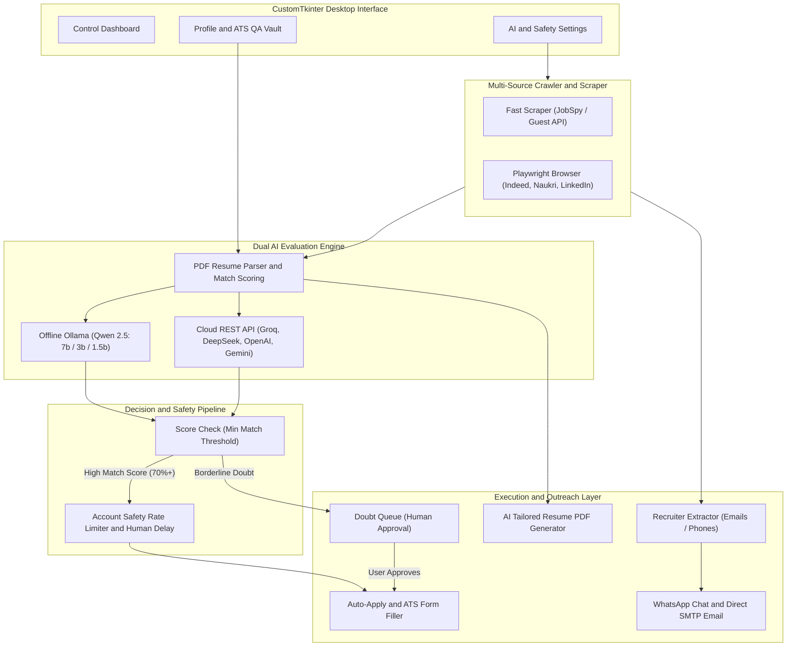

# 🚀 VENTURE — Autonomous Job Search & Outreach Assistant

[](LICENSE)
[](#installation)
[](#features)
[](https://ollama.com)
[](#ai-setup-guide)

An advanced, stealthy desktop assistant that concurrently crawls major job platforms (**Indeed**, **Naukri**, and **LinkedIn**), evaluates job description match using a **Local LLM (Qwen 2.5 via Ollama)** or **Cloud REST API**, autofills applications, and extracts recruiter contacts for direct **WhatsApp & SMTP cold outreach**!

---

## 🌟 Key Features

- **🎨 Modern CustomTkinter Desktop GUI**: Sleek dark glassmorphism interface with rounded controls, real-time log streaming, and metric analytics.
- **🤖 Dual AI Engine (Local + Cloud)**:
  - **Local Ollama Mode**: 100% Private, zero cloud costs using `qwen2.5:7b`, `3b`, or `1.5b`.
  - **Cloud REST API Mode**: Zero system load for low-spec PCs using OpenAI, DeepSeek, Groq, Google Gemini, or Custom Endpoints.
- **📇 Recruiter Contact Extractor & Direct Outreach**: Automatically detects HR emails, phone numbers, and recruiter names. Provides 1-click **WhatsApp Direct Chat (`wa.me`)** and **SMTP Direct Email Outreach**.
- **📄 AI Resume Tailorer & PDF Generator**: Automatically rewrites professional summaries and achievement bullets tailored for target job descriptions, exporting formatted PDF resumes on demand.
- **📑 Candidate QA Vault (Smart ATS Memory)**: Stores experience years, notice period, salary expectations, work authorization, and relocation preferences for intelligent form auto-filling.
- **🛡️ Account Safety & Anti-Bot Protection**: Configurable daily application caps and randomized human typing/browsing delays (15s–45s) to protect your job board accounts.
- **⚑ Doubt Queue Approvals**: Holds borderline or high-salary jobs in a manual review queue where you can review AI explanations before applying.

---

## 📊 System Architecture & Workflow Pipeline



### 🔄 End-to-End Execution Flow

```text
┌────────────────────────┐      ┌────────────────────────┐      ┌────────────────────────┐
│  1. SEARCH & CRAWL     │  ──► │  2. AI EVALUATION      │  ──► │  3. SAFETY & FILTER    │
│  Crawls Indeed, Naukri │      │  Parses PDF resume &   │      │  Enforces daily cap    │
│  & LinkedIn via        │      │  scores match via      │      │  & human typing delay  │
│  Playwright/JobSpy     │      │  Ollama / Cloud LLM    │      │  (15s - 45s)           │
└────────────────────────┘      └────────────────────────┘      └────────────────────────┘
            │                                                               │
            ▼                                                               ▼
┌────────────────────────┐                                      ┌────────────────────────┐
│  5. RECRUITER OUTREACH │      ◄────────────────────────────── │  4. ACTION & APPLY     │
│  Extracts HR emails &  │      Generates Tailored Resume PDF   │  Auto-fills ATS forms  │
│  phones for 1-click    │      & routing for direct outreach   │  or queues in Doubt    │
│  WhatsApp & SMTP Email │                                      │  Approvals tab         │
└────────────────────────┘                                      └────────────────────────┘
```

## 💻 System Requirements

| System Spec | Recommended AI Setup | System Load |
|---|---|---|
| **Low Specs** (4GB RAM, Dual-Core CPU, No GPU) | **Cloud API Mode** (Groq / DeepSeek / Gemini) OR `qwen2.5:1.5b` | **0% PC Lag** |
| **Mid Specs** (8GB–16GB RAM, i5/i7 CPU) | **Local Ollama Mode** (`qwen2.5:3b` or `qwen2.5:7b`) | **100% Private** |
| **High Specs** (16GB+ RAM, NVIDIA GPU) | **Local Ollama Mode** (`qwen2.5:7b` or `qwen2.5:14b`) | Maximum Performance |

---

## ⚙️ Installation Guide (Cross-Platform)

### 🪟 Windows (10/11)

```powershell
# 1. Clone Repository
git clone https://github.com/chittranshsharma/venture.git
cd venture

# 2. Create Virtual Environment
python -m venv venv
.\venv\Scripts\activate

# 3. Install Dependencies
pip install -r requirements.txt
playwright install chromium
```

---

### 🐧 Linux (Ubuntu, Debian, Fedora, Arch, Manjaro)

#### Ubuntu / Debian / Mint:
```bash
# 1. System Dependencies
sudo apt update && sudo apt install -y python3 python3-pip python3-venv git

# 2. Clone & Setup
git clone https://github.com/chittranshsharma/venture.git
cd venture
python3 -m venv venv
source venv/bin/activate

# 3. Install Python Dependencies & Playwright System Libraries
pip install -r requirements.txt
playwright install --with-deps chromium
```

#### Fedora / RHEL / CentOS:
```bash
sudo dnf install -y python3 python3-pip git
git clone https://github.com/chittranshsharma/venture.git
cd venture
python3 -m venv venv
source venv/bin/activate
pip install -r requirements.txt
playwright install --with-deps chromium
```

#### Arch Linux / Manjaro:
```bash
sudo pacman -S python python-pip git
git clone https://github.com/chittranshsharma/venture.git
cd venture
python3 -m venv venv
source venv/bin/activate
pip install -r requirements.txt
playwright install --with-deps chromium
```

---

### 🍎 macOS (Apple Silicon M1/M2/M3/M4 & Intel)

```bash
# 1. Clone Repository
git clone https://github.com/chittranshsharma/venture.git
cd venture

# 2. Create Virtual Environment
python3 -m venv venv
source venv/bin/activate

# 3. Install Dependencies
pip install -r requirements.txt
playwright install chromium
```

---

## 🧠 AI Setup Guide (Local vs Cloud)

### Option A: Local AI Setup (Ollama — 100% Private)

#### 🪟 Windows:
1. Download installer from **[ollama.com/download/windows](https://ollama.com/download/windows)**.
2. Run `OllamaSetup.exe`.
3. Open Command Prompt or PowerShell and pull a model:

```powershell
# For Low/Mid Spec PCs (Fast ~1.1GB):
ollama pull qwen2.5:1.5b

# For Mid Spec PCs (Recommended balance ~2.0GB):
ollama pull qwen2.5:3b

# For High Spec PCs (High accuracy ~4.7GB):
ollama pull qwen2.5:7b
```

#### 🐧 Linux (All Distros):
Run the official single-line install script:

```bash
curl -fsSL https://ollama.com/install.sh | sh

# Pull your model:
ollama pull qwen2.5:3b
```

#### 🍎 macOS:
Install via Homebrew or direct DMG download:

```bash
# Via Homebrew:
brew install ollama

# Start service & pull model:
ollama serve &
ollama pull qwen2.5:3b
```

*In the App Settings GUI, select **Local Ollama** and pick your installed model!*

---

### Option B: Cloud AI Setup (Zero System Load for Low-Spec PCs)

If your computer has low specs (e.g. 4GB RAM), use Cloud API mode for **instant AI evaluation with 0% system load**:

1. Open the App ➔ Navigate to **AI & Search Settings**.
2. Select **Cloud AI / REST API**.
3. Choose your provider preset:
   - **Groq** (Super fast, free tier available) ➔ Base URL: `https://api.groq.com/openai/v1`, Model: `openai/gpt-oss-120b`
   - **DeepSeek** ➔ Base URL: `https://api.deepseek.com/v1`, Model: `deepseek-chat`
   - **OpenAI** ➔ Base URL: `https://api.openai.com/v1`, Model: `gpt-4o-mini`
   - **Google AI** ➔ Base URL: `https://generativelanguage.googleapis.com/v1beta`, Model: `gemini-2.5-flash`
4. Enter your API Key or Username/Password, click **⚡ Test Connection**, and save!

---

## 🚀 Post-Installation Setup & First-Time Walkthrough

After installing dependencies and setting up your AI engine (Ollama or Cloud API), follow these steps to set up and run VENTURE:

### 1. Launch the Application
- **Windows (1-Click Launcher)**: Simply double-click `run_app.bat` inside the cloned directory.
  > 💡 *Note: `run_app.bat` uses `%~dp0` to automatically detect your current folder path on any drive or directory, so you don't need to edit any `cd` paths!*
  
  Or launch manually via Command Prompt / PowerShell:
  ```powershell
  python gui_app.py
  ```
- **Linux / macOS**: Open terminal inside the project directory and run:
  ```bash
  python3 gui_app.py
  ```

---

### 2. First-Time Setup in GUI (5 Simple Steps)

#### 📌 Step 1: Candidate Profile & ATS QA Vault (`◉ My Profile`)
- Enter your **Full Name**, **Email**, **Phone**, **LinkedIn URL**, **GitHub URL**, and **Portfolio URL**.
- Provide the full local path to your **Resume PDF** (e.g. `C:\Users\YourName\Documents\resume.pdf` or `/home/user/resume.pdf`).
- Add your **Technical Skills** (e.g., `Python`, `React`, `SQL`).
- **Fill Candidate QA Vault**: Enter default answers for common ATS questions (*Years of Experience*, *Notice Period*, *Current & Expected CTC*, *Work Authorization*, *Relocation*) so the auto-filler answers recurring questions without stopping.
- Click **Save Profile**.

#### 🔒 Step 2: Platform Credentials & SMTP Outbox (`🔒 Credentials`)
- **Job Board Credentials**: Optionally enter your logins for **Indeed**, **Naukri**, and **LinkedIn**. *(If left blank, the bot will use your active Edge browser session or prompt you to log in once)*.
- **SMTP Mail Server**: Enter your SMTP host (e.g. `smtp.gmail.com`), port (`587`), email address, and App Password to enable direct 1-click recruiter email outreach.
- Click **Save Credentials**.

#### 🧠 Step 3: Configure AI Engine & Connect Local AI (`⚙ AI & Search`)
- **Connecting Local AI (Ollama)**:
  - Ensure Ollama service is running locally (`ollama serve` or Ollama system tray icon).
  - The app connects to the default local path: `http://127.0.0.1:11434/api/generate`.
  - In the App Settings GUI under **AI Engine Provider**, select **Local Ollama (Offline)**.
  - Click **Refresh Models** — the app will automatically query your local Ollama path and populate the dropdown with all models installed on your system (e.g., `qwen2.5:7b`, `3b`, or `1.5b`).
- **Connecting Cloud AI (REST API)**:
  - Select **Cloud AI / REST API**.
  - Choose a preset (Groq, DeepSeek, OpenAI, Gemini), enter your API Key, and click **⚡ Test Connection**.

#### 🎯 Step 4: Job Search Queries & Safety Limits (`⚙ AI & Search`)
- **Target Job Queries**: Add roles you want to target (e.g., *Software Engineer*, *AI Developer*, *Full Stack Engineer*).
- **Skip Keywords**: Add keywords you want to avoid (e.g., *C++*, *COBOL*, *Sales*).
- **Geographic Scope**: Select **Entire Country** or choose specific **Cities & States** using the location hierarchy selector.
- **Account Safety Limits**: Enable **Account Safety Mode**, set a **Daily Application Cap** (default: `25` jobs/day), and set **Human Emulation Delays** (e.g., `15` to `45` seconds).
- Click **Save All Settings**.

#### 🤖 Step 5: Start the Bot & Monitor (`⊞ Dashboard`)
- Navigate to the **Control Dashboard**.
- Click **▶ Start Bot**.
- Watch real-time logs in the **Operation Logs** panel and track metrics on the live analytics dashboard.

---

### 3. Using Advanced Features During Bot Execution

- **⚑ Doubt Queue Approvals**: When the AI finds borderline jobs or non-standard titles, they appear in the **Approvals** tab. Select any job to inspect AI match explanations and click **`✓ Approve & Apply`** or **`✕ Reject & Skip`**.
- **📇 Recruiter Contacts Outreach**: Extracted recruiter details appear in the **Recruiter Contacts** tab. Click **`💬 Open WhatsApp Chat`** to message recruiters on WhatsApp or **`✉️ Send Direct Email`** to send a tailored cover letter & resume attachment via SMTP.
- **📄 AI Tailored Resume Generator**: Click **`📄 Tailor Resume PDF`** on any job suggestion or contact card to generate a custom-tailored PDF resume saved directly to `tailored_resumes/`.

---

## 📂 Project Structure

```
venture/
├── automation/             # Playwright automation, LLM evaluators, fast scrapers
│   ├── bot_runner.py       # Multi-platform browser crawler & safety engine
│   ├── form_autofiller.py  # Smart ATS QA Vault form autofiller
│   ├── job_scraper.py      # Rapid multi-site job search scraper
│   ├── llm_evaluator.py    # Dual Local/Cloud LLM evaluation logic
│   └── status_tracker.py   # Application status scanner
├── core/                   # System core modules
│   ├── config_manager.py   # JSON configuration & location hierarchy manager
│   ├── contact_extractor.py# Regex & AI recruiter contact extractor
│   ├── db_manager.py       # SQLite database engine & metrics engine
│   ├── email_smtp.py       # Direct SMTP outreach engine
│   ├── resume_exporter.py # AI-tailored PDF resume generator
│   ├── resume_parser.py   # PyPDF2 resume parser
│   └── state.py            # Global shared runtime state & thread-safe flags
├── ui/                     # CustomTkinter Dark GUI Views
│   ├── app_window.py       # Main window & sidebar navigation
│   ├── components.py       # Design system, pill-chips, rounded CTk widgets
│   ├── dashboard_view.py   # Analytics dashboard & RAG AI assistant chat
│   ├── history_view.py     # Application history table
│   ├── suggestions_view.py # Career suggestions & cover letter generator
│   ├── approvals_view.py   # Human-in-the-loop doubt queue approvals
│   ├── contacts_view.py    # Recruiter contacts, WhatsApp & SMTP outreach
│   ├── settings_view.py    # AI provider, search thresholds & safety settings
│   ├── profile_view.py     # Candidate profile & ATS QA vault setup
│   └── accounts_view.py    # Platform logins & SMTP credentials setup
├── gui_app.py              # Application entry point
├── run_app.bat             # Windows one-click batch launcher
├── config.json             # Local user configuration file (Git-ignored)
├── config.json.example     # Example configuration template for setup
├── applied_jobs.csv        # Application database (Git-ignored)
└── recruiter_contacts.csv  # Recruiter database (Git-ignored)
```

---

## 🔒 Security & Privacy

- **Local Credentials**: All passwords and API keys are stored locally in `config.json`, which is automatically ignored by `.gitignore`.
- **Local LLM Mode**: Zero data leaves your computer when running with local Ollama.
- **Local Edge Profile**: Chrome/Edge browser automation uses a local persistent profile context on your machine.

---

## 📄 License

Distributed under the MIT License. See `LICENSE` for more details.
