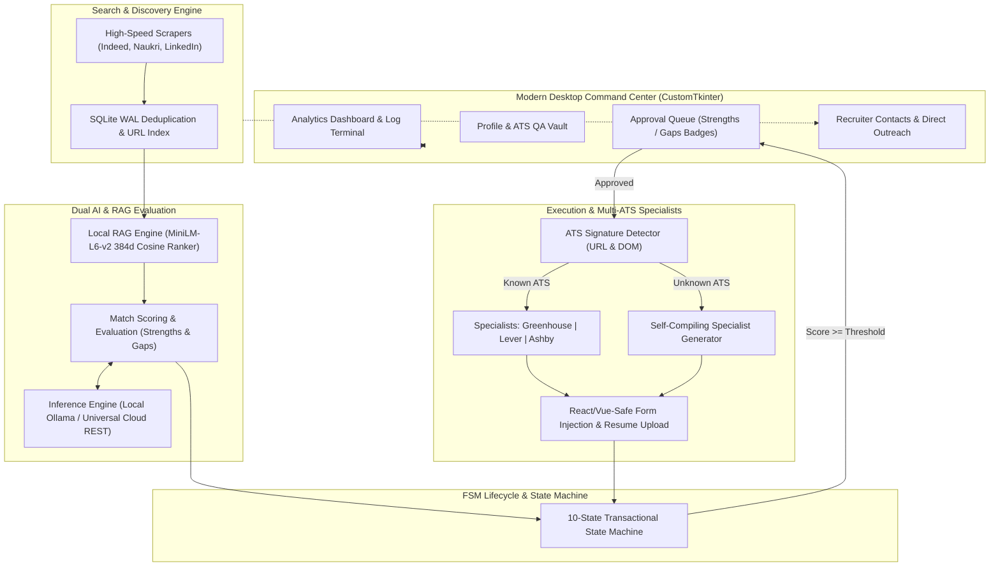

# 🚀 VENTURE — Autonomous AI Job Application & Career Intelligence Platform

<p align="center">
  
  
  
  
  
  
</p>

---

**VENTURE** is an enterprise-grade, autonomous job application agent and recruiter intelligence system. Built for speed, privacy, and precision, VENTURE bridges local vector-space embeddings (**MiniLM-L6-v2**), local/cloud LLMs (**Ollama Qwen 2.5, DeepSeek, OpenAI, Groq, Gemini**), a crash-resilient **10-state Finite State Machine (FSM)**, and a self-compiling multi-ATS automation pipeline to search, evaluate, tailor, and apply to high-fit roles at scale.

---

## ⚡ Core Innovations & Capabilities

### 🧠 1. Local RAG Semantic Scoring Engine (`core/rag_scorer.py`)
- **384-Dimensional Vector Embeddings**: Embeds candidate resume bullet points into dense vector space using `sentence-transformers/all-MiniLM-L6-v2`.
- **Cosine Relevance Ranking**: Ranks individual experience bullets against the specific Job Description via normalized dot products, sending only the **top-5 most semantically aligned highlights** to the LLM.
- **Token Efficiency & Noise Reduction**: Slashes prompt payload size by **40–60%** while eliminating signal dilution and providing 100% explainable match justification.

### 🛡️ 2. Anti-Hallucination 4-Step Resume Tailoring (`core/resume_exporter.py`)
- **Step 1 — JD Keyword Extraction**: Mines key technical terms and ATS competencies solely from the target job posting.
- **Step 2 — Conservative Support Filter**: Cross-examines extracted keywords against candidate experience; strictly drops unsupported technologies.
- **Step 3 — Bounded Content Generation**: Directs the LLM to construct tailored summaries and bullet points strictly using supported vocabulary.
- **Step 4 — AST & Regex Violation Guard**: Real-time scans generated text against common tech stacks. If fabrication is detected, it auto-retries with explicit forbidden clauses or falls back to verified skills. Generates high-impact, professional PDF resumes.

### 🌐 3. Multi-ATS Detection & Zero-LLM Specialists (`automation/specialists/`)
- **Universal ATS Detector (`automation/ats_detector.py`)**: Analyzes URL patterns and DOM signatures to immediately identify career platforms (**Greenhouse, Lever, Ashby, Workday, BambooHR, SmartRecruiters, LinkedIn, Indeed, Naukri**).
- **Dedicated Specialists**: Instant, zero-LLM handlers execute deterministic form fills for Greenhouse, Lever, and Ashby in sub-second time.
- **Self-Compiling Specialist Generator (`automation/specialists/generator.py`)**: When the generalist fallback successfully solves an unfamiliar ATS portal, it records the action trace, triggers AST-validated code synthesis, conducts security sandboxing, and automatically writes a reusable Python specialist for zero-cost subsequent applications.

### 🔄 4. Crash-Resilient Finite State Machine & SQLite WAL (`core/state_machine.py`)
- **10-State Atomic Lifecycle**: Every opportunity progresses through verifiable states:
  ```
  DISCOVERED ➔ SCRAPED ➔ QUALIFIED ➔ APPROVED ➔ FORM_OPENED 
  ➔ RESUME_UPLOADED ➔ FIELDS_FILLED ➔ SUBMITTED (or REJECTED / FAILED)
  ```
- **Crash Recovery**: Sessions interrupted by network drops or power outages automatically resume from the last known state without duplicate applications or lost context.
- **High-Concurrency SQLite WAL**: Fast, thread-safe persistence with zero lock contention.

### 📑 5. Comprehensive ATS QA Vault (`automation/form_autofiller.py`)
- **Extended Profile Schema**: Stores critical Indian and global application parameters (10th/12th percentages, university CGPA, degree/branch, notice period, current & expected CTC, stipend expectations, and categorized skills).
- **React/Vue-Safe Form Autofill**: Bypasses framework virtual DOM trapping using native prototype setter overrides (`Object.getOwnPropertyDescriptor(proto, 'value').set`), ensuring full input event firing.

### 📇 6. Recruiter Contact Extraction & 1-Click Cold Outreach (`core/contact_extractor.py`)
- **Entity Discovery**: Mines recruiter names, hiring manager contacts, and verified email/phone combinations directly from job postings.
- **Direct Multi-Channel Outreach**: Instant **1-Click WhatsApp (`wa.me`)** chat initiation and automated **SMTP cold email outreach** with tailored resume attachments.

---

## 🏗️ System Architecture & Execution Pipeline



---

## 🎯 Supported ATS Platforms & Portals

| ATS / Platform | Detection Mechanism | Handler Type | Execution Time |
|---|---|---|---|
| **Greenhouse** | `boards.greenhouse.io`, `div#application` | Dedicated Specialist | < 1.2s |
| **Lever** | `jobs.lever.co`, `.postings-sections` | Dedicated Specialist | < 1.0s |
| **Ashby** | `jobs.ashbyhq.com`, `div[data-ashby-widget]` | Dedicated Specialist | < 1.5s |
| **Workday** | `.myworkdayjobs.com`, DOM Automation IDs | Self-Compiling / Generalist | Variable |
| **BambooHR** | `.bamboohr.com/jobs`, DOM Signature | Self-Compiling / Generalist | Variable |
| **SmartRecruiters** | `jobs.smartrecruiters.com` | Self-Compiling / Generalist | Variable |
| **Indeed** | `indeed.com`, Native Easy Apply & Redirects | Native Playwright Engine | Interactive |
| **Naukri** | `naukri.com`, Fast Apply & Company Links | Native Playwright Engine | Interactive |
| **LinkedIn** | `linkedin.com`, Easy Apply & Career Redirects | Native Playwright Engine | Interactive |

---

## 💻 Hardware Requirements & AI Modes

| Profile | Recommended AI Setup | RAM | Compute | Privacy Level |
|---|---|---|---|---|
| **Ultra-Light** | **Universal Cloud REST API** (Groq, DeepSeek, Gemini, OpenAI) | 4 GB | Dual-Core CPU | Encrypted Transit |
| **Balanced** | **Local Ollama** (`qwen2.5:3b` or `qwen2.5:1.5b`) | 8 GB | Standard Quad-Core | 100% Offline / Local |
| **Pro / Power** | **Local Ollama** (`qwen2.5:7b` or `qwen2.5:14b`) | 16 GB+ | NVIDIA RTX / Apple Silicon | 100% Offline / Local |

---

## 🛠️ Installation & Setup

### 1. Clone Repository & Setup Environment

#### Windows (PowerShell / Command Prompt):
```powershell
# Clone the repository
git clone https://github.com/chittranshsharma/venture.git
cd venture

# Create and activate virtual environment
python -m venv venv
.\venv\Scripts\activate

# Install dependencies and browser drivers
pip install -r requirements.txt
playwright install chromium
```

#### macOS / Linux:
```bash
# Clone the repository
git clone https://github.com/chittranshsharma/venture.git
cd venture

# Create and activate virtual environment
python3 -m venv venv
source venv/bin/activate

# Install dependencies and browser drivers
pip install -r requirements.txt
playwright install chromium
```

---

### 2. Configure AI Provider

#### Option A: Local Ollama (Recommended for 100% Offline Privacy)
1. Install Ollama from **[ollama.com](https://ollama.com)**.
2. Pull your preferred model:
   ```bash
   ollama pull qwen2.5:3b
   # Or for high precision:
   ollama pull qwen2.5:7b
   ```
3. Start the Ollama server:
   ```bash
   ollama serve
   ```
4. In VENTURE's **AI & Search Settings**, select **Local Ollama (Offline)**. Click **Refresh Models** to auto-detect installed weights.

#### Option B: Cloud AI / REST Endpoints (Zero System Load)
VENTURE features universal compatibility with any OpenAI-compliant or provider-native REST endpoint:
- **Groq**: Base URL `https://api.groq.com/openai/v1`, Model `openai/gpt-oss-120b` or `llama-3.3-70b-versatile`
- **DeepSeek**: Base URL `https://api.deepseek.com/v1`, Model `deepseek-chat`
- **Google Gemini**: Base URL `https://generativelanguage.googleapis.com/v1beta`, Model `gemini-2.5-flash`
- **OpenAI**: Base URL `https://api.openai.com/v1`, Model `gpt-4o-mini`

---

## 🚀 Quick Launch Walkthrough

### 1. Launch the Application
- **Windows**: Double-click [`run_app.bat`](file:///d:/JobPilot-AI/run_app.bat) or run `python gui_app.py`.
- **macOS / Linux**: Run `python3 gui_app.py`.

### 2. Configure Your Profile & ATS QA Vault (`◉ My Profile`)
- Fill in your name, contact details, social URLs, and local path to your base PDF resume.
- Complete the **Education & Academic Scores** section (10th/12th percentages, Degree, University, CGPA).
- Populate the **Candidate QA Vault** with your notice period, compensation expectations, work preferences, and work authorizations.
- Group technical proficiencies in **Technical Skills by Category** (Primary, Tools, Databases, Cloud).

### 3. Set Search Targets & Safety Boundaries (`⚙ AI & Search`)
- Add target job queries (e.g. *Full Stack Developer*, *Backend Engineer*, *Machine Learning Engineer*).
- Define negative search filters in **Skip Keywords** to discard irrelevant postings.
- Choose geographic scope (Entire Country or tailored city/state selections).
- Set daily application limits (e.g., `25` applications/day) and randomized human browsing delays (`15s`–`45s`) to protect your accounts.

### 4. Start Autonomous Operations (`⊞ Dashboard`)
- Hit **▶ Start Bot** on the Control Dashboard.
- Watch live operational telemetry, streaming logs, and real-time state machine transitions.
- Inspect borderline matches in the **Approvals** tab with clear **Strengths (✓)** and **Gaps (⚠)** breakdowns.

---

## 📁 Repository Directory Structure

```
venture/
├── automation/                 # Web automation, scrapers & multi-ATS specialists
│   ├── ats_detector.py         # URL pattern & DOM signature platform detector
│   ├── bot_runner.py           # Core execution dispatcher & browser lifecycle
│   ├── form_autofiller.py      # React-safe DOM injector & QA vault mapper
│   ├── job_scraper.py          # Rapid multi-board aggregator & parser
│   ├── llm_evaluator.py        # RAG-backed match evaluation engine
│   ├── status_tracker.py       # Application status & feedback auditor
│   └── specialists/            # Zero-LLM platform specialists
│       ├── __init__.py
│       ├── greenhouse.py       # Dedicated Greenhouse board filler
│       ├── lever.py            # Dedicated Lever job portal filler
│       ├── ashby.py            # Dedicated Ashby application filler
│       ├── generalist.py       # Universal fallback & action trace recorder
│       └── generator.py        # Self-compiling AST specialist generator
├── core/                       # Core system modules & runtime engines
│   ├── config_manager.py       # Settings schema & configuration persistence
│   ├── contact_extractor.py    # Recruiter regex & entity discovery engine
│   ├── credential_store.py     # OS Keyring encrypted credentials vault
│   ├── db_manager.py           # SQLite WAL persistence & transactional metrics
│   ├── email_smtp.py           # Multi-provider SMTP outreach engine
│   ├── rag_scorer.py           # 384-dimensional vector embedding & ranking
│   ├── resume_exporter.py      # 4-step guarded anti-hallucination PDF builder
│   ├── resume_parser.py        # PDF text extractor & normalizer
│   ├── state.py                # Thread-safe global runtime state
│   └── state_machine.py        # 10-state crash-recovery FSM engine
├── ui/                         # CustomTkinter glassmorphism user interface
│   ├── app_window.py           # Shell container & navigation controller
│   ├── components.py           # Design tokens, action buttons & tag chips
│   ├── dashboard_view.py       # Metric analytics, live logs & AI assistant
│   ├── history_view.py         # Application ledger & state status viewer
│   ├── suggestions_view.py     # Discovered leads & resume tailoring actions
│   ├── approvals_view.py       # Strengths/gaps breakdown & manual approvals
│   ├── contacts_view.py        # Recruiter directory & 1-click outreach
│   ├── settings_view.py        # AI provider configurations & search params
│   ├── profile_view.py         # Candidate profile & extended ATS QA vault
│   └── accounts_view.py        # Platform authentication & SMTP configuration
├── tailored_resumes/           # Generated PDF resumes (grounded & tailored)
├── screenshots/                # Audit captures of matches & application steps
├── config.json.example         # Reference environment configuration schema
├── selectors.yaml              # Externalized ATS selector definitions
├── requirements.txt            # Python dependencies specification
├── run_app.bat                 # Windows one-click desktop launcher
└── gui_app.py                  # Platform entry point
```

---

## 🔒 Security & Privacy Guarantees

- **100% Local Confidentiality**: In Local Ollama mode, your resume content, job search queries, and personal data never leave your workstation.
- **Hardware-Encrypted Credentials**: Passwords and private API tokens are saved in secure OS Keyring storage, never plain text.
- **AST Sandboxing**: Dynamically generated ATS specialists undergo abstract syntax tree validation and security scanning against forbidden patterns (`os.system`, `subprocess`, `eval`, `exec`) before execution.
- **Native User Session Protection**: Uses your local browser profile to avoid triggering automated bot detection signals.

---

## ⚖️ License

Distributed under the **MIT License**. See [LICENSE](file:///d:/JobPilot-AI/LICENSE) for complete terms.
